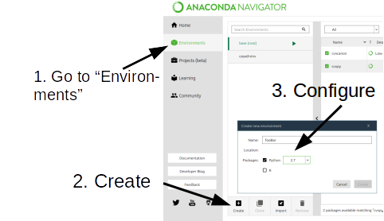
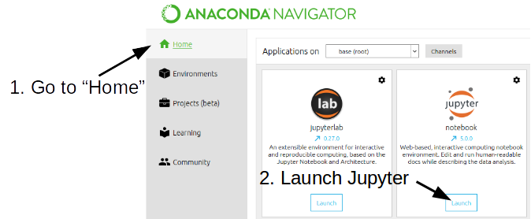

## Anaconda

After you start the anaconda navigator, do the following...

### Create a new Anaconda environment
Create a new conda environment (and activate it by clicking on the play button)


### Add a new package
From within the new environment you have created...


**Important note:** CVXPy is likely to not show up on the list on some systems. In that case, you need to [add it using conda](https://www.cvxpy.org/install/index.html).

Open a terminal and activate your environment:

```
source activate <nameOfYourEnvironment>
```

and then run:

```
conda install -c conda-forge lapack
conda install -c cvxgrp cvxpy
```


### Start Jupyter
Start Jupyter (you might need to install it first). This will fire up a browser window.


